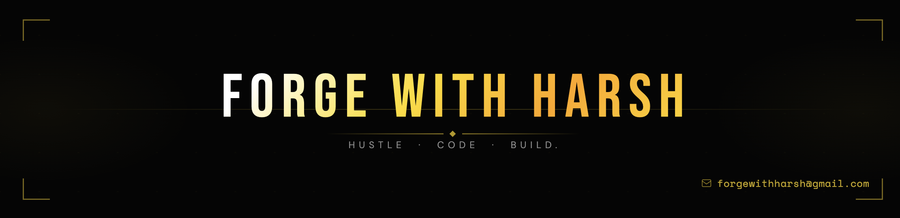

<!-- Banner --> 

  
  
    

<!-- Social Media Links -->

 &nbsp;&nbsp;  &nbsp;&nbsp;  &nbsp;&nbsp; 

<!-- About Me -->

### &nbsp; Hi there

- Computer Science Student.

- MERN Stack Developer with strong interest in scalable systems.

- Currently in a focused learning phase to strengthen fundamentals and become a better developer.

- Happy to connect with amazing people and build an awesome developer network.

 

<!-- Technologies that I'm working with -->

###  &nbsp; Tech-Stack

  

 

 &nbsp; **Tools**

  

 

&nbsp;

 

  

